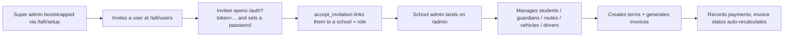
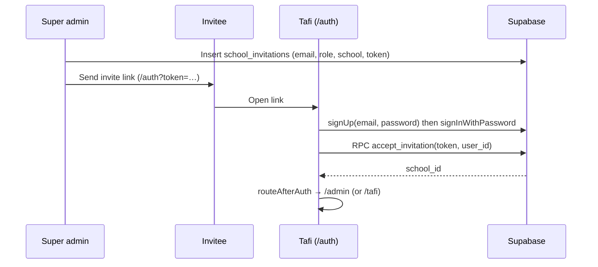

# Tafi — Current State & UX Discovery Report

**Status:** Discovery / audit only. No application code was modified.
**Date of audit:** 2026-10-04
**Repository:** `github.com/annewaithaka/Tafi` — branch `main`, single commit `c9e74d8` ("Initial commit", Anne Waithaka, 2026-09-29).
**Scope of evidence:** The repository at commit `c9e74d8`, inspected statically (source, SQL migrations, config). The app was **not** run; no dependencies were installed. Claims that require a running browser (rendered layout, contrast ratios, real network behaviour) are marked UNKNOWN or flagged as code-derived.

---

## How to read this document

Every non-trivial claim is tagged:

- **FACT** — directly verified in the code / SQL / config in this repo.
- **OBSERVATION** — something that is visibly true of the current implementation as written (may be code-derived rather than screen-verified).
- **INFERENCE** — a reasonable interpretation that still needs owner confirmation.
- **UNKNOWN** — cannot be determined from the repository.

Where a claim is derived from reading code but was **not** confirmed by running the app, that is stated explicitly. This matters: this report does not yet include screen-by-screen visual QA, real-device testing, or automated accessibility results.

> **IMPORTANT:** Nothing in this document is a redesign proposal. It is a description of what exists, plus the questions we need answered before any cleanup or UX work begins.

---

## 1. Executive Summary

**What Tafi appears to be.** Tafi is a school-transport safety platform aimed at the Kenyan market. Its public landing page markets a WhatsApp-first product for **parents** ("Real-time updates from verified drivers — delivered to WhatsApp, SMS, and email"), with schools and operators as secondary audiences. **FACT.**

**What the software actually does today.** The running application is *not* the WhatsApp parent product. It is an internal operations tool with two working portals:

1. A **School Admin portal** (`/admin`) — manages students, guardians, routes, vehicles, drivers, and term-based billing (invoices + payments).
2. A **Tafi Super-Admin portal** (`/tafi`) — a cross-school platform view plus user/invitation management.

The parent/driver/WhatsApp experiences that the landing page sells are **not implemented** in the repo. **FACT.**

**The central tension.** The marketing site and the shipped admin product describe two different products. The database was clearly designed with the larger vision in mind (`driver`, `parent`, `transport_manager`, `operator` roles; a `scan_events` table for QR pickup/drop-off scans; `qr_code` student tags; geo-coordinates for routes and home addresses), but almost none of that vision is exposed in the UI. **FACT + INFERENCE.**

**Biggest issues found (detail in §13–§14):**

- No reachable way to create the **first school**, because sign-up is invite-only and invitations require an existing school to be selected. This is a software dead-end as written. **FACT (code-derived).**
- Global toast feedback is effectively invisible: the app calls `toast(...)` in 9 files but never mounts a `<Toaster />`. Users get no success/error confirmation. **FACT (code-derived).**
- The "Regenerate" QR action sets a student's `qr_code` to `NULL`; the auto-fill trigger only fires on `INSERT`, so the code is not recreated. **FACT (code-derived).**
- `.env` is committed to git (publishable/client keys + a Google Maps browser key). **FACT.**
- A `claim_first_super_admin()` SQL function is exposed to any authenticated user and can mint a super-admin if none exists; the UI never calls it. **FACT.**

**Recommendation.** Do **not** start cleanup. Confirm the product direction with the owner first (is Tafi the parent WhatsApp product, the school ops tool, or a staged build of both?), because most of the UX "problems" are really open product questions. See §16 and §20.

---

## 2. Project Overview

| Item | Value | Label |
|---|---|---|
| Product name | Tafi | FACT |
| Repository | `github.com/annewaithaka/Tafi` (origin), branch `main` | FACT |
| History | 1 commit ("Initial commit") | FACT |
| Provenance | Generated/managed via **Lovable** (`.lovable/`, README, error-reporting hooks) | FACT |
| Other agent tooling present | `.kilo/worktrees/cold-dessert/` — a **second full git worktree** of the same commit (detached HEAD) | FACT |
| Product domain | School transport safety / logistics for Kenyan schools | FACT |
| Documented brand line | "Safe school transport, via WhatsApp" | FACT |
| Supported currency | KES (Kenyan Shilling) | FACT |
| Supported locale cues | Kenyan phone placeholders (`+254…`), "Riverside Academy", "Karen — Ngong Road", M-Pesa payment method | FACT |

**Repository hygiene notes (FACT):**

- `tafi-landing.html` (≈540 KB) is a **standalone static duplicate** of the landing page, committed at the repo root. It is not served by the app (the `/` route is a React component) and appears to be a leftover prototype/export.
- `.kilo/worktrees/cold-dessert/` is a second checkout registered in `.git/worktrees/`. It duplicates the entire project. Neither `.kilo` nor its worktree is ignored by git, so these are working-copy artifacts sitting inside the repo.
- Two lockfiles are committed (`bun.lock` and `package-lock.json`), plus `bunfig.toml` — the intended package manager is UNKNOWN.

---

## 3. Current Architecture

### 3.1 Technology stack (all FACT, from `package.json`, `vite.config.ts`, `tsconfig.json`)

| Layer | Technology | What it is used for |
|---|---|---|
| App framework | **TanStack Start** (`@tanstack/react-start`) + **React 19** | SSR-capable full-stack React framework; server functions (`createServerFn`) |
| Routing | **TanStack Router** (`@tanstack/react-router`) | File-based routing under `src/routes/`, typed routes, route guards via `beforeLoad` |
| Data fetching | **TanStack Query** v5 | Client-side data fetching/caching/mutations, invalidations |
| Language | **TypeScript** 5.8 (`strict: true`) | Whole codebase |
| Build | **Vite** 8 + `@lovable.dev/vite-tanstack-config`; build target **Nitro → Cloudflare** (per config comments) | Dev server + production build |
| Styling | **Tailwind CSS v4** (via `@tailwindcss/vite`), CSS-first `@theme` in `src/styles.css` | All styling; design tokens live in CSS |
| Component library | **shadcn/ui** ("new-york" style, slate base, CSS variables) over **Radix UI** primitives | UI primitives (button, dialog, table, etc.) |
| Icons | **lucide-react** | Iconography |
| Notifications | **sonner** | Toasts (see §13 — not mounted) |
| Backend / DB / Auth | **Supabase** (`@supabase/supabase-js`) — Postgres + Auth + Row-Level Security | Data, authentication, authorization |
| Maps | **Google Maps JS API + Places** (browser key from env) | Address picking, route pickup previews |
| Fonts | Google Fonts: **Instrument Sans** (sans), **Inter** (display), **JetBrains Mono** (mono) | Landing page typography; see §12 for an inconsistency |

**No test framework, no CI config, no lint/test scripts beyond `lint`/`format`.** There is no `test` script in `package.json` and no test files. **FACT.**

### 3.2 Runtime / data-flow shape

```mermaid
flowchart TD
  Browser["Browser (React 19 / TanStack Start)"]
  subgraph Server["Server (TanStack Start server fns; SSR off for /_authenticated)"]
    FN["server functions\n(setup, deleteSchool, users)"]
    MW["requireSupabaseAuth middleware"]
  end
  SB["Supabase\nPostgres + Auth + RLS"]
  GM["Google Maps JS API"]

  Browser -->|supabase-js (anon/publishable key + user JWT)| SB
  Browser -->|RPC to server fns| FN
  FN --> MW --> SB
  Browser -->|script tag + browser key| GM
```

- The browser talks **directly to Supabase** for almost all reads/writes, protected by **RLS**. **FACT.**
- A small number of privileged operations run through **server functions** using a **service-role** Supabase client (`supabaseAdmin`) that bypasses RLS: `deleteSchool`, `setUserActive`, `listUsersAdmin`, `bootstrapTafi`. **FACT.**
- `/_authenticated` is declared `ssr: false` in `src/routes/_authenticated/route.tsx`, so authenticated areas render client-side only. **FACT.**

### 3.3 Authentication & authorization

- **Auth provider:** Supabase Auth (email + password). **FACT.**
- **Session handling:** `supabase.auth.getSession()` / `getUser()`; a preview-only brokered storage shim lets the Lovable editor share login (`previewAuthStorage.ts`). **FACT.**
- **Authorization model:** a `user_roles` table + a `has_role(user_id, role)` SQL helper; RLS policies check `has_role(...)` and `current_school_id()`. **FACT.**
- **Roles defined (`app_role` enum):** `super_admin`, `school_admin`, `transport_manager`, `driver`, `parent`, `operator`. **FACT.**
- **Roles actually used by the UI:** only `super_admin` and `school_admin`. The other four have **no screens and no RLS policies granting them access to any operational table** (only their own profile). **FACT.**

### 3.4 Database schema (FACT, from `supabase/migrations/*.sql`)

| Table | Purpose | Notes |
|---|---|---|
| `schools` | Tenant root | name, contact, phone, address, geo columns |
| `profiles` | One row per auth user | `full_name`, `phone`, `school_id` (FK) |
| `user_roles` | Role assignments | `(user_id, role, school_id)`, unique |
| `guardians` | Parents/guardians per school | name, phone, whatsapp, email |
| `routes` | Bus routes per school | `name`, `description`, `active`, `pickup_points jsonb` (unused in UI) |
| `vehicles` | Buses per school | `plate`, `capacity`, `route_id` |
| `drivers` | Drivers per school | `full_name`, `phone`, `license_no`, `vehicle_id` |
| `students` | Pupils per school | `full_name`, `class`, `qr_code`, `guardian_id`, `route_id`, `home_address` + geo, `term_fee_kes`, `active` |
| `invoices` | Per-student, per-term charges | `period_label`, `amount_kes`, `opening_balance_kes`, `due_date`, `status` |
| `payments` | Payments against invoices | `amount_kes`, `method`, `reference`, `paid_at`, `student_id`, `period_label` |
| `terms` | School terms (3-month, Kenya) | `name`, `starts_on`, `ends_on`, `due_date`, `fee_kes`, `active` |
| `school_invitations` | Invite-by-token | `email`, `role`, `school_id`, `token`, `expires_at`, `used_at` |
| `scan_events` | QR pickup/drop-off scans | `student_id`, `driver_id`, `event_type`, `scanned_at`, `lat`, `lng` — **no UI consumes this** |

**SQL functions (FACT):** `set_updated_at`, `has_role`, `current_school_id`, `handle_new_user`, `onboard_school_admin`, `claim_first_super_admin`, `accept_invitation`, `generate_student_qr_code`, `recompute_invoice_status`.

**Enums (FACT):** `app_role` (6 values), `invoice_status` = `pending | partial | paid | overdue`.

**Automation (FACT):**

- `payments_recompute_invoice_status` — recalculates an invoice's status whenever a payment is inserted/updated/deleted.
- `set_student_qr_code` — **BEFORE INSERT only** — auto-generates a QR code from student initials if blank. (Central to a bug — see §13.)
- `on_auth_user_created` — creates a `profiles` row on signup.

### 3.5 Environment variables (names only — values not printed) — FACT

Present in the tracked `.env`:

- `SUPABASE_URL`, `SUPABASE_PUBLISHABLE_KEY`, `SUPABASE_PROJECT_ID`
- `VITE_SUPABASE_URL`, `VITE_SUPABASE_PUBLISHABLE_KEY`, `VITE_SUPABASE_PROJECT_ID`
- `VITE_LOVABLE_CONNECTOR_GOOGLE_MAPS_BROWSER_KEY`, `VITE_LOVABLE_CONNECTOR_GOOGLE_MAPS_TRACKING_ID`

Also referenced in code but **not** present in `.env` (expected to be provided by the hosting platform at runtime): `SUPABASE_SERVICE_ROLE_KEY` (service role, server-only) and `TAFI_SETUP_TOKEN` (guards the first-super-admin bootstrap). **FACT.**

> **Security note (FACT):** `.env` is **committed to git** (it appears in `git ls-files`). It contains *publishable/client* keys (Supabase anon/publishable key and a Google Maps browser key) rather than the service-role secret — so the blast radius is limited, but committing `.env` is poor hygiene and the Maps browser key is abusable unless restricted by HTTP referrer / API restrictions in Google Cloud. Review with the owner.

### 3.6 External services & integrations (FACT)

- **Supabase** (hosted project id `riaefoonilvgrqifapzi`) — data, auth, RLS.
- **Google Maps JavaScript API + Places Autocomplete** — address picking and route pickup mapping.
- **Lovable** — build platform; error-reporting shims forward runtime errors to the Lovable editor context (no-op outside the editor).
- **GitHub** — source of truth; commits sync back to Lovable.

---

## 4. Current Product Understanding

### 4.1 What Tafi is (evidence-based definition)

> **Tafi is a school-transport operations platform for Kenyan schools.** A school admin manages pupils, guardians, bus routes, vehicles and drivers, and bills families per term (invoices + payments in KES). Above that sits a Tafi-operated super-admin console that lists every school with usage/outstanding-balance stats and manages platform users and invitations. The product is marketed to parents as a WhatsApp-based safety/visibility service, but that parent-facing experience is not built yet.
> — **FACT** (structure) + **INFERENCE** (framing).

### 4.2 Problem it appears to solve

| Goal | Evidence | Label |
|---|---|---|
| Give schools one place to run school transport (roster, fleet, routes) | `/admin` portal; students/guardians/routes/vehicles/drivers screens | FACT |
| Bill families per term and track outstanding balances | `terms`, `invoices`, `payments`, billing screen, outstanding KPIs | FACT |
| Give Tafi staff a cross-school operational view | `/tafi` dashboard aggregating schools/students/vehicles/outstanding | FACT |
| Give *parents* live safety updates over WhatsApp | Landing copy, `scan_events`, `qr_code`, `parent` role | FACT (built/planned) — **not implemented in UI** |
| Give *drivers* a check-in/scanner app | `driver` role, `scan_events.event_type` | FACT — **not implemented** |
| Multi-school / operator fleet management on one platform | Landing "For operators" card, `operator` role | FACT — **not implemented** |

### 4.3 Core workflow (as currently built)



The intended entry (bootstrap → invite → school admin operates) exists. **However**, the invite step requires picking an existing school, and there is no UI to create a school — see the dead-end in §13/§14. **FACT.**

---

## 5. Users / Personas

| Persona | Who they are | What they appear to need | What they can do today | Screens | Status |
|---|---|---|---|---|---|
| **Tafi Super Admin** | Tafi staff/operator | Oversight of all schools; manage platform users | Cross-school stats; invite users; revoke/remove roles; deactivate accounts; delete a school | `/tafi`, `/tafi/users` | **Working** |
| **School Admin** | A school's transport/administrative staff | Manage roster, fleet, routes; bill families | Full CRUD on students, guardians, routes, vehicles, drivers; create terms; generate invoices; record/edit/delete payments; edit school profile | `/admin` + 8 sub-pages | **Part-working** (blocked by bootstrap gap + toast gap) |
| **Transport Manager** | School transport coordinator | (presumably) route/fleet oversight | Nothing — role exists but has no screens or policies | — | **Missing but apparently intended** |
| **Driver** | Bus driver | Check children in/out (QR scans); see route | Nothing — role exists; `scan_events` table exists; no UI | — | **Missing but apparently intended** |
| **Parent** | Mother/father/guardian | Know their child is safe; live updates | Nothing — role exists; marketed heavily; no UI; no WhatsApp integration in repo | — | **Missing but apparently intended** |
| **Operator** | Multi-school fleet operator | Run multiple schools on one platform | Nothing — role exists; only mentioned in marketing | — | **Missing but apparently intended** |

**UNKNOWN:** which persona is the *primary* user for the next phase. The landing page says parents; the shipped software serves school admins. This is the single most important question for the owner (§16, Q1).

---

## 6. Feature Inventory

State legend: **Working**, **Partially working**, **Placeholder**, **Prototype**, **Unclear**, **Broken**, **Dead/unused**, **Missing but intended**.

| Feature | Where implemented | What it does | User(s) | State | Evidence | Notes |
|---|---|---|---|---|---|---|
| Landing / marketing page | `src/routes/index.tsx` | Hero, timeline, WhatsApp demo animation, pricing cards, testimonial, CTA, footer | Public | **Working** (as a brochure) | file | Copy sells a parent WhatsApp product not present in-app; several CTAs are `#` no-ops; testimonial + "12,000+ parents" unsourced |
| Static duplicate of landing | `tafi-landing.html` | Standalone HTML of the same page | Public | **Dead/unused** | file at root | Not routed; leftover artifact |
| Email/password sign-in | `src/routes/auth.tsx` | Sign-in for existing users | All | **Working** | file | Posts `signInWithPassword`, then routes by role |
| Invite acceptance | `src/routes/auth.tsx` + RPC `accept_invitation` | New user sets a password from a token link, joins a school | Invitees | **Partially working** | file + migration | Depends on email-confirmation setting (UNKNOWN); token in URL; no email match check |
| First super-admin bootstrap | `src/routes/tafi.setup.tsx` + `setup.functions.ts` | Token-gated creation of the first super admin | Tafi staff | **Working** (ops tool) | files | Requires `TAFI_SETUP_TOKEN` env; token compare is non-constant-time |
| School self-onboarding | `admin.tsx` `Onboarding` + RPC `onboard_school_admin` | Creates a school for an authenticated user with no school | School admin | **Unreachable / dead-end** | file + migration | No sign-up UI, so this path cannot be reached (see §13.1) |
| Super-admin platform dashboard | `tafi.index.tsx` | KPI tiles + per-school table (students, vehicles, drivers, invoices, outstanding) | Super admin | **Working** | file | Aggregates client-side from full table scans |
| Delete a school | `tafi.index.tsx` + `tafi.functions.ts` (`deleteSchool`) | Permanently deletes a school + all children, after typing the name | Super admin | **Working** (destructive) | files | Hard delete with cascades; service-role server fn; strong confirm dialog |
| User & invitation management | `tafi.users.tsx` + `users.functions.ts` | Create/revoke invites, copy invite link, remove roles, deactivate/reactivate accounts | Super admin | **Working** | files | Uses native `confirm()` for some actions; list capped at 200 users |
| Students CRUD | `admin.students.tsx` + `resource-crud.tsx` | Add/edit/delete students; assign guardian & route; home address; term fee; QR display | School admin | **Partially working** | files | QR **regenerate is broken** (§13.2); generic form |
| Guardians CRUD | `admin.guardians.tsx` | Add/edit/delete guardians | School admin | **Working** | file | |
| Routes CRUD + pickup map | `admin.routes.tsx` | Add/edit/delete routes; view pickup points on a Google map with nearest-neighbour ordering; open directions | School admin | **Working** | file | Ordering is heuristic; students without coordinates are flagged |
| Vehicles CRUD | `admin.vehicles.tsx` | Add/edit/delete vehicles; assign route | School admin | **Working** | file | |
| Drivers CRUD | `admin.drivers.tsx` | Add/edit/delete drivers; assign vehicle | School admin | **Working** | file | No link to a login user |
| Dashboard (school) | `admin.index.tsx` | Count tiles (students/guardians/routes/vehicles/drivers/invoices) + outstanding balance | School admin | **Working** | file | Loads all invoices to sum outstanding |
| Terms | `admin.billing.tsx` | Create terms with dates + default fee | School admin | **Partially working** | file | `terms.fee_kes` is captured but **not used** for invoice generation |
| Invoice generation | `admin.billing.tsx` | Generate per-student invoices for a term (term fee + a shared opening balance) | School admin | **Working** | file | Skips students already invoiced; opening balance applies to all at once |
| Payments | `admin.billing.tsx` | Record/edit/delete payments; invoice status auto-recomputes | School admin | **Working** | file + migration | `overdue` status never set; `cancelled` styling unused |
| School settings + address | `admin.settings.tsx` + `AddressPicker.tsx` | Edit school details and geo-location | School admin | **Working** | files | `Label`s not associated with inputs (§11) |
| Parent/guardian notifications | — | WhatsApp/SMS/email alerts | Parent | **Missing but intended** | landing page; `guardians.whatsapp` | No provider, templates, or send code |
| Live bus tracking | — | Real-time location of the bus | Parent | **Missing but intended** | landing page; geo columns | No tracking source; `scan_events` not surfaced |
| Driver QR check-in | — | Driver scans child in/out | Driver | **Missing but intended** | `scan_events`, `qr_code` | Table exists; no UI, scanner, or API |
| Parent-facing app/bot | — | Parent asks "where is my child?" | Parent | **Missing but intended** | landing page | No WhatsApp/bot integration in repo |
| M-Pesa payment integration | — | Automated payments/splits | Schools/operators | **Missing but intended** | landing page | Only manual payment *recording* exists |
| Password reset | — | Recover a forgotten password | All | **Missing but intended** | `auth.tsx` | No forgot-password flow anywhere |
| Tests / CI | — | Automated verification | Team | **Missing** | repo | No test runner, no CI |

---

## 7. Screen / Page Inventory

### 7.1 `/` — Landing page

| Field | Detail |
|---|---|
| Route | `/` (`src/routes/index.tsx`) |
| Purpose | Marketing/brochure page for Tafi |
| Target user | Public (parents, schools, operators) |
| Entry point | Direct link / search |
| Main actions | "Get started free" (scrolls to `#product`), "Watch demo" (scrolls to `#demo`), nav "School portal" → `/auth`, "Tafi admin" → `/auth?portal=tafi` |
| Secondary actions | Pricing CTAs (`#pricing`, `#`, `#contact`) |
| Information displayed | Hero claim, channel chips (WhatsApp/Email/SMS), "4.9/5, 12,000+ parents", animated WhatsApp chat, safety timeline, 3 audience/pricing cards, testimonial, final CTA, footer |
| Components | Local components (`Nav`, `Hero`, `WhatsAppDemo`, `Timeline`, `Product`, `Testimonial`, `FinalCTA`, `Footer`) |
| Forms/inputs | None |
| Empty/loading/error states | N/A |
| Mobile behaviour | Responsive utility classes; large display type; not visually verified |
| Problems | (1) Markets a product the app doesn't contain; (2) multiple `href="#"` / `#contact` targets with no destination; (3) two visually distinct nav links ("School portal", "Tafi admin") both route to `/auth`; (4) unsourced social proof/testimonial; (5) nav "Pricing" points to `#product` |

### 7.2 `/auth` — Sign in / accept invitation

| Field | Detail |
|---|---|
| Route | `/auth` (`?token=…&portal=tafi`) |
| Purpose | Authenticate; accept an invitation |
| Target user | School admins, Tafi staff, invitees |
| Main actions | Sign in; (if token) create password and accept invite |
| Info displayed | Title/description vary by mode; email/password; name (invite mode) |
| States | No explicit loading/empty states; busy text on button; errors via `toast` (invisible — §13.3) |
| Mobile behaviour | Centered card, single column; fine |
| Problems | No "forgot password"; no sign-up without a token; no success feedback (toasts invisible); invite token in URL |

### 7.3 `/tafi/setup` — First super-admin bootstrap

| Field | Detail |
|---|---|
| Route | `/tafi/setup` |
| Purpose | Create the very first super admin (one-time) |
| Target user | Tafi operator/developer |
| Main actions | Enter setup token + name/email/password → create |
| Problems | Discoverability UNKNOWN (not linked anywhere); toasts invisible; token handling noted in §13 |

### 7.4 `/admin` — School Admin shell + dashboard

| Field | Detail |
|---|---|
| Route | `/admin` (layout) — dashboard at `/admin/` |
| Purpose | School transport operations hub |
| Target user | School admin |
| Entry | After sign-in (role ≠ super_admin), or onboarding |
| Layout | Sidebar (Dashboard, Students, Guardians, Routes, Vehicles, Drivers, Billing, Settings; optional "Tafi admin"; "View landing page"; Sign out). Mobile: overlay drawer |
| Dashboard content | 6 count tiles + "Outstanding balance" card |
| States | Loading ("Loading…"); Onboarding form if no school; redirect for supers |
| Problems | Outstanding loads every invoice client-side; secondary pages return `null` (blank) if profile/school not loaded; toasts invisible |

### 7.5 `/admin/students`

| Field | Detail |
|---|---|
| Purpose | CRUD students |
| Columns | Full name, Class, Guardian, Route, QR code (+ Regenerate), Term fee |
| Form fields | Full name\*, Class, Guardian (select), Route (select), QR code, Home pickup address (map), Term fee |
| Problems | **QR regenerate broken** (§13.2); no active/inactive toggle despite `students.active`; long form + map inside a fixed dialog |

### 7.6 `/admin/guardians`, `/admin/vehicles`, `/admin/drivers`

| Field | Detail |
|---|---|
| Purpose | CRUD each resource via the shared `ResourceCrud` component |
| Guardians fields | Full name\*, Phone, WhatsApp, Email |
| Vehicles fields | Plate\*, Capacity, Assigned route |
| Drivers fields | Full name\*, Phone, License #, Assigned vehicle |
| States | Loading; empty ("No … yet. Click New to add one.") |
| Problems | Delete uses native `confirm()`; tables can overflow on mobile; toasts invisible |

### 7.7 `/admin/routes`

| Field | Detail |
|---|---|
| Purpose | CRUD routes + visualise pickup points |
| Extra | "View pickups" dialog: Google map of the school + numbered student stops, missing-coordinate list, "Open in Google Maps" |
| Problems | Ordering is nearest-neighbour from school only; relies on students having coordinates; map dialog has no explicit height cap on small screens |

### 7.8 `/admin/billing`

| Field | Detail |
|---|---|
| Purpose | Terms, invoices, payments |
| Content | 3 KPI cards; New term dialog; term filter buttons; Invoices table (8 columns); Recent payments table with edit/delete |
| Actions | Create term, generate invoices, record payment, edit payment, delete payment |
| Empty states | "No invoices yet…", "No payments recorded yet." |
| Problems | 8-column table on mobile; `terms.fee_kes` unused; opening balance applied to all students at once; `overdue` never set; status colours ad-hoc |

### 7.9 `/admin/settings`

| Field | Detail |
|---|---|
| Purpose | Edit school name/contact/address |
| Extra | `AddressPicker` with map, lat/lng inputs, "use my location" |
| Problems | `Label`s not linked to inputs; map block can be tall |

### 7.10 `/tafi` — Super-admin dashboard

| Field | Detail |
|---|---|
| Purpose | Cross-school overview |
| Content | KPI tiles (Schools, Students, Vehicles, Outstanding); Schools table (Students, Vehicles, Drivers, Invoices, Outstanding, Delete) |
| States | Loading; "No schools yet." |
| Problems | Table has 7 columns (mobile overflow); delete is irreversible; aggregates from full scans |

### 7.11 `/tafi/users`

| Field | Detail |
|---|---|
| Purpose | Invite/manage users |
| Content | Invite form (email, role, school, expiry); Pending invitations table; Active users table with roles + status + activate/deactivate |
| Actions | Invite, copy link, revoke invite, remove role, deactivate/reactivate |
| States | "No pending invitations.", "No active users yet." |
| Problems | `confirm()` for destructive actions; invite requires a school for non-super roles → first-school dead-end; deactivation list capped at 200 |

### Duplicate / overlapping screens (FACT)

- **Two landing artifacts:** routed `/` page and `tafi-landing.html`.
- **Two sidebars:** `admin-shell.tsx` and the inline `TafiShell` in `tafi.tsx` are near-copies.
- **Two auth entry points to the same screen:** "School portal" and "Tafi admin" both go to `/auth`.
- **Three role-detection paths:** `auth.tsx#routeAfterAuth`, `admin.tsx` (`["my-roles"]`), `tafi.tsx` (`["roles"]`).

---

## 8. User Flows

### 8.1 First-time user (invited)



- **Start:** invite link. **Goal:** get into the portal.
- **Friction:** no email-confirmation step in UI; **no visible success/error messages** (toasts unmounted); if Supabase requires email confirmation, `signInWithPassword` right after `signUp` may fail (UNKNOWN). If the invite had no school (not creatable in UI), `accept_invitation` creates a "New school".

### 8.2 Returning user

`/` → "School portal"/"Tafi admin" → `/auth` → sign in → `routeAfterAuth` → `/admin` or `/tafi`. **Friction:** role resolved client-side via a `.limit(50)` query; no "forgot password".

### 8.3 Primary workflow (school admin, end-to-end)

Sign in → `/admin` → add guardians → add students (guardian + route + home address + term fee) → add vehicles/drivers and assign → create a term → generate invoices → record payments. **Friction:** feedback invisible; QR regen broken; billing math simple; mobile tables.

### 8.4 Secondary workflows

- **Route planning:** `/admin/routes` → "View pickups" → ordered stops / directions.
- **Address capture:** any address field → search/click/drag map, type lat/lng, or "use my location".
- **User administration:** `/tafi/users` → invite / copy link / revoke / remove role / deactivate.

### 8.5 Authentication flow

Supabase email/password only. Session persisted in `localStorage` (or brokered to the Lovable editor). `_authenticated` guard redirects unauthenticated users to `/auth`; `admin.tsx`/`tafi.tsx` add role redirects. **No** password reset, magic link, OAuth, MFA, or self-deletion.

### 8.6 Error / recovery flows

- Root error boundary (`__root.tsx` `ErrorComponent`) → "Try again" / "Go home".
- 404 page (`NotFoundComponent`).
- Catastrophic SSR error → standalone `renderErrorPage()` HTML.
- **Gap:** form/action errors surface only through unmounted toasts, so most failed actions appear to do nothing. **FACT (code-derived).**

### 8.7 Admin / management flow

Super admin: `/tafi` (stats, delete school) ↔ `/tafi/users` (invites, roles, activation). Guarded by `has_role(super_admin)` in RLS and server functions.

### 8.8 Payment / transaction flow

**Manual only.** No payment gateway. Staff record a payment against an invoice; a DB trigger recomputes the invoice status (`pending`/`partial`/`paid`). The marketing "M-Pesa payment splits" is **not** implemented. **FACT.**

### 8.9 Data create / edit / delete

CRUD is generic (`ResourceCrud` for 5 tables; bespoke forms for billing/settings/users; `deleteSchool` for schools). Deletes are **hard deletes** (no soft delete / undo). School deletion cascades.

### 8.10 Dead ends discovered (FACT, code-derived)

1. **Cannot create the first school.** Sign-up requires an invite; invites for `school_admin` require an existing school; there is no "create school" UI. The only school-creating code paths (`onboard_school_admin`; `accept_invitation` with a null school) are unreachable from the UI.
2. **No password recovery.**
3. **Marketing CTAs with no destination** (`#`, `#contact`, `#pricing` scroll only).

---

## 9. UX / UI Audit

> Static review of source. No rendered, device, or assistive-tech testing was performed, so interactive/a11y claims are marked accordingly.

### 9.1 Information architecture

- The school-admin sidebar groups the right things (people, fleet, routes, money, settings). **OBSERVATION.** Sensible hierarchy: dashboard → resource lists → billing → settings.
- The **super-admin** portal is minimal (Dashboard, Users) — adequate for its scope.
- **Two namespaces for two audiences** (`/admin` vs `/tafi`) is sensible, **but** confusing to a newcomer: "Tafi admin" (internal console) vs "School portal" both land on the same `/auth` screen, differing only by subtitle. **OBSERVATION.**
- The public site's "Pricing" nav item scrolls into product cards rather than a pricing section. **FACT.**

### 9.2 Interaction design

- Primary actions are generally obvious (one "New" per list; "Save" in dialogs). **OBSERVATION.**
- **Feedback is the weak point:** success/error messages are emitted as toasts that never render (§13.3). **FACT (code-derived).**
- Destructive actions are inconsistent: school deletion uses a strong `AlertDialog` (type-name-to-confirm); row deletions use the browser's native `confirm()`; invitations/roles also use `confirm()`. **FACT.**
- Forms rely on HTML `required` and button disabling; no inline validation or field-level errors. **OBSERVATION.**

### 9.3 Visual hierarchy

- Dashboards use consistent Card + metric patterns. **OBSERVATION.**
- The landing page has strong, deliberate hierarchy; the app is plainer. The two surfaces look like different products (different fonts — §12). **OBSERVATION.**
- Status indicators use **ad-hoc** Tailwind colours (`bg-green-100 text-green-700`, `bg-amber-100…`, `bg-emerald-100…`) rather than tokens. **FACT.**

### 9.4 Consistency (see also §12)

- **Buttons:** landing CTAs use bespoke classes (`bg-ink`, `bg-accent`, rounded-full) while the app uses shadcn variants. Two visual languages. **OBSERVATION.**
- **Form controls:** several screens use raw `<select>` while shadcn `Select` exists but is unused. **FACT.**
- **Radius/shadow:** landing uses very large radii (`rounded-[2rem]`, `rounded-[3rem]`); app uses the token scale. **OBSERVATION.**
- **Terminology:** "School portal" vs "School admin sign in"; "Tafi admin" vs "Super admin". Not aligned. **OBSERVATION.**

### 9.5 Empty / loading / error states

- Lists have decent empty states. **OBSERVATION.**
- Loading is a bare "Loading…" text; no skeletons (a `Skeleton` exists but is unused). **FACT.**
- Most pages have no error state for failed queries; a failure typically shows an empty list or the global boundary. **OBSERVATION.**
- Secondary admin pages `return null` when profile/school hasn't loaded → momentary blank screen. **FACT.**

---

## 10. Responsive / Mobile Audit

> Code-derived. **Not** verified on real devices or in a browser (app was not run).

| Area | Finding | Label |
|---|---|---|
| Sidebars | Both shells switch to a full-height overlay drawer below `md` (768px) with a hamburger. Reasonable pattern. | OBSERVATION |
| Tables | shadcn `Table` wraps content in `<div class="relative w-full overflow-auto">`, so wide tables **scroll horizontally**. Billing (8 cols) and Tafi schools (7 cols) will be hard to read on phones. | OBSERVATION (code) |
| Dialogs | `DialogContent` has `max-w-*` but **no max-height/overflow** and is vertically centred. Tall dialogs (student form with embedded map; pickups grid) can exceed a phone viewport and clip their own footer/actions. | OBSERVATION (code) |
| AddressPicker | Fixed map height (`h-56`) and a `grid-cols-[1fr_1fr_auto]` lat/lng/button row — tight on narrow screens; map not collapsible. | OBSERVATION (code) |
| Landing hero | Display type up to `text-[5.5rem]`; stacks below `lg`. Likely fine but unverified. | OBSERVATION |
| KPI grids | Admin `sm:grid-cols-2 lg:grid-cols-3`; Tafi `grid-cols-2 lg:grid-cols-4`. Fine. | OBSERVATION |
| Images | Landing uses `object-cover` with fixed aspect ratios; no obvious overflow risk. | OBSERVATION |
| Overall | The apps are "desktop layout in a responsive container"; main mobile risks are wide tables + tall dialogs, not outright breakage. **Live mobile QA still required.** | INFERENCE |

**UNKNOWN:** real overflow, tap-target sizes, and text truncation on actual devices.

---

## 11. Accessibility Observations

> Static review only. **No** automated audit (axe/Lighthouse) and **no** screen-reader testing were run. **No** WCAG conformance is claimed or disproven.

| Area | Finding | Label |
|---|---|---|
| Form labels | Many `<Label>` elements are not associated with inputs (no `htmlFor`/`id`), especially in billing dialogs, settings, and user management. Screen readers may not announce them. | FACT (code) |
| Icon-only buttons | Icon buttons (edit/delete/regenerate/copy) rely on `title` (or nothing) rather than `aria-label`. Weak accessible names. | OBSERVATION |
| Destructive dialogs | The school-delete `AlertDialog` provides title + description + type-to-confirm — good. | FACT |
| Native `confirm()` | Used for several destructive actions; accessible-ish but inconsistent and unstyled. | FACT |
| Semantic structure | Dashboards use a single `h1` via `PageHeader`; resource pages use `h1`. `/auth` and `/tafi/setup` have no `h1` (only card titles). | FACT |
| Focus states | shadcn `focus-visible:ring` on inputs/buttons; custom landing CTAs use `hover:` transforms without equivalent focus styles. | OBSERVATION |
| Contrast | Token colours defined in `oklch`; actual contrast **not** measured. Some `text-muted-foreground` on light backgrounds and landing `opacity-40`/`opacity-70` are suspicious but unverified. | UNKNOWN |
| Motion | The landing WhatsApp demo auto-loops; there is **no** `prefers-reduced-motion` handling. | FACT |
| Keyboard | No skip-to-content link; dialogs come from Radix (focus trap expected). Tab order unverified. | OBSERVATION/UNKNOWN |

---

## 12. Design System Audit

### 12.1 What exists (FACT — `src/styles.css`)

- **Tokens:** Tailwind v4 `@theme` + `:root` (light) / `.dark` blocks, all colours in `oklch`.
- **Custom semantic colours:** `brand` (orange, `oklch(0.66 0.19 42)`), `safe` (green, `oklch(0.52 0.14 158)`), `ink`, `surface`, plus the standard shadcn set (background, foreground, card, primary, muted, accent, destructive, border, input, ring, chart-1..5, sidebar-*).
- **Radius scale:** `--radius: 0.625rem` with `sm/md/lg/xl/2xl/3xl/4xl` derived tokens.
- **Fonts:** `--font-sans` (Instrument Sans), `--font-display` (Inter), `--font-mono` (JetBrains Mono), loaded via Google Fonts in `__root.tsx`.
- **Dark mode:** variables exist, but there is **no theme toggle** and no `.dark` class is applied by application code → effectively unused. **FACT.**
- **Component primitives:** 46 shadcn files under `src/components/ui/`.

### 12.2 Where the implementation violates its own system

| Violation | Evidence | Label |
|---|---|---|
| **App pages don't use the configured sans font.** `styles.css` sets `--font-sans` but the base layer only sets background/colour; only the landing page's root div applies `font-sans`/`font-display`. Admin/tafi pages fall back to the browser default font. | `styles.css` base layer; `index.tsx` uses `font-sans`; admin files do not | FACT (code) |
| **Ad-hoc status colours** instead of `brand`/`safe`/`destructive` tokens (green/amber/emerald/gray literal classes). | `admin.billing.tsx`, `tafi.users.tsx` | FACT |
| **Raw `<select>` elements** styled inline instead of the `Select` primitive. | billing, users, resource-crud | FACT |
| **Two radius/shadow languages:** landing uses `rounded-[2rem]`/`rounded-[3rem]` + custom shadows; app uses the token radius scale. | `index.tsx` vs app | OBSERVATION |
| **Unused primitives** (33 of 46): accordion, avatar, calendar, carousel, chart, checkbox, collapsible, command, context-menu, drawer, dropdown-menu, form, hover-card, input-otp, menubar, navigation-menu, pagination, popover, progress, radio-group, resizable, scroll-area, select, sidebar, slider, switch, tabs, textarea, toggle-group, and more. Only ~13 are imported anywhere. | import scan | FACT |
| **Unused deps** from the scaffold: `react-hook-form`, `@hookform/resolvers`, `zod`, `recharts`, `embla-carousel-react`, `react-day-picker`, `cmdk`, `vaul`, `react-resizable-panels`, `input-otp`, `date-fns` — no non-UI file imports them. | dependency scan | FACT |

**Net:** a design system is *defined* (tokens + shadcn) but only **partly applied**, and the two surfaces (marketing vs app) diverge. Strong signal that the landing page was built separately/earlier than the app.

---

## 13. Technical / UX Findings

Technical facts that directly change the user experience. Severity assigned in §18.

### 13.1 The first-school dead-end — **Critical**

**FACT (code-derived).** `auth.tsx` offers only sign-in, or invite acceptance when a `token` is present. School admins are invited to an *existing* school (`tafi.users.tsx` refuses a non-super invite without a school). Nothing in the UI creates a school. The only school-creating functions (`onboard_school_admin`; `accept_invitation` with a null school) cannot be reached: the former needs an authenticated user with no school (no sign-up path); the latter needs an invite the UI won't create. Net effect: **a fresh deployment cannot get its first school through the app.**

### 13.2 QR "Regenerate" wipes the code — **High**

**FACT (code-derived).** `admin.students.tsx` regenerates by setting `qr_code = NULL` (expecting a trigger to refill it). But `generate_student_qr_code` is `BEFORE INSERT ON public.students` **only** — there is no `UPDATE` trigger. So regenerating leaves `qr_code` null while still showing "QR regenerated". Also, the stored QR value is a text code never rendered as an actual QR image anywhere.

### 13.3 All toast feedback is invisible — **High**

**FACT (code-derived).** Nine files import `toast` from `sonner`, but `<Toaster />` (from `src/components/ui/sonner.tsx`) is never mounted in `__root.tsx` or either shell. With sonner, `toast()` without a mounted `<Toaster />` shows nothing. This silently hides success *and* error feedback across auth, CRUD, billing, users, and school deletion.

### 13.4 `.env` committed — **High (security hygiene)**

**FACT.** `.env` is tracked in git and contains client-publishable Supabase keys and a Google Maps browser key. Not catastrophic (no service-role secret), but treat the keys as exposed, restrict the Maps key in Google Cloud, and untrack `.env`.

### 13.5 `claim_first_super_admin()` exposed — **High (security)**

**FACT.** The SQL function is `SECURITY DEFINER`, granted to `authenticated`, and inserts a `super_admin` role for the caller **if none exists**. The UI never calls it (dead client code in `admin-data.ts`), but it is callable directly via the Supabase RPC endpoint by any authenticated user while no super admin exists. Realistic only in a fresh/empty deployment, but worth locking down.

### 13.6 Invite token handling — **Medium (security)**

**FACT.** Invite tokens are passed in the URL (`/auth?token=…`), stored plainly in `school_invitations`, and `accept_invitation(token, user_id)` does **not** verify the accepting user's email matches the invited email. Anyone holding the link can claim it.

### 13.7 Redundant / inconsistent role resolution — **Medium**

**FACT.** Three mechanisms answer "is this user a super admin?": `auth.tsx` (`select("role").limit(50)`), `admin.tsx` (key `["my-roles"]`), `tafi.tsx` (key `["roles"]`), plus `admin-shell.tsx` calling `getMyRoles()` uncached. Causes duplicate requests and divergent state after role changes.

### 13.8 Client-side aggregation over full scans — **Medium**

**FACT.** The Tafi dashboard and the school "outstanding" metric load full tables (`invoices`, `payments`, …) and sum in the browser. Degrades as data grows (blank/spinner moments).

### 13.9 Billing model gaps — **Medium**

**FACT.** (a) `terms.fee_kes` is captured but never used — invoices use each student's `term_fee_kes`. (b) Opening balance is a single amount applied to every student in a run, not per student. (c) `invoice_status.overdue` is never assigned; the "cancelled" styling branch is unreachable. (d) No credit/refund or partial-term logic.

### 13.10 Data-model limits that block the marketed product — **Medium/High (product)**

- `students.guardian_id` is a single FK → no shared/secondary guardians.
- `drivers` have no `user_id` → a driver can't be given a login; the `driver` role is unusable.
- No parent↔student link table → a `parent` role can't be scoped to their children.
- `routes.pickup_points jsonb` exists but is unused; stop ordering is computed ad hoc.
- `scan_events` exists but nothing writes or reads it.

### 13.11 Auth/UX gaps — **Medium**

No password reset, no email-verification UX, no account settings for the signed-in user (name/phone), no session-expiry messaging. `signUp` → immediate `signInWithPassword` may fail if email confirmation is required (UNKNOWN).

### 13.12 Duplicated code — **Low/Medium**

- Two near-identical sidebars (`admin-shell.tsx`, `tafi.tsx`).
- Static duplicate landing page (`tafi-landing.html`).
- Duplicate lockfiles.

### 13.13 Error handling — **Low/Medium**

Server functions throw plain `Error`s that surface (if at all) through invisible toasts; there is a root error boundary but most data-layer failures render as empty lists. No per-query error UI.

---

## 14. Known Issues (consolidated)

| # | Issue | Severity | Label |
|---|---|---|---|
| 1 | Cannot create the first school via the UI (invite↔school circular dependency) | Critical | FACT (code) |
| 2 | `<Toaster />` never mounted → all success/error feedback invisible | High | FACT (code) |
| 3 | QR "regenerate" nulls the code (trigger is INSERT-only) | High | FACT (code) |
| 4 | `.env` committed to git (client keys + Maps browser key) | High | FACT |
| 5 | `claim_first_super_admin()` callable by any authenticated user | High | FACT |
| 6 | No password reset / account recovery | High | FACT |
| 7 | Landing page sells features that don't exist in the app | High (product) | FACT |
| 8 | Invite token in URL; no email match on acceptance | Medium | FACT |
| 9 | Inconsistent role-resolution + duplicate fetches | Medium | FACT |
| 10 | Full-table client aggregation for stats | Medium | FACT |
| 11 | `terms.fee_kes` unused; shared opening balance; `overdue` unused | Medium | FACT |
| 12 | Raw `<select>` / ad-hoc colours instead of the design system | Medium | FACT |
| 13 | App doesn't use the configured font | Medium | FACT (code) |
| 14 | Wide tables + uncapped tall dialogs on mobile | Medium | OBSERVATION |
| 15 | Labels not associated with inputs (a11y) | Medium | FACT (code) |
| 16 | Dead code: `claimFirstSuperAdmin`, `useSession`, `MapPreview`, 33/46 UI components, many deps | Low | FACT |
| 17 | Duplicate sidebars, duplicate landing HTML, duplicate lockfiles, stray `.kilo` worktree | Low | FACT |
| 18 | Native `confirm()` for destructive row actions (inconsistent) | Low | FACT |
| 19 | No tests / CI | Low (Medium over time) | FACT |
| 20 | 404/error states unstyled relative to the design system | Low | OBSERVATION |

---

## 15. Unknowns / Assumptions

**UNKNOWN (cannot be determined from the repo):**

1. Which product/persona is the priority (parents vs schools vs operators).
2. Whether the WhatsApp/SMS/email parent product is planned, in progress elsewhere, or abandoned.
3. Whether the school-ops tool is the intended near-term product or a stepping stone.
4. Supabase project auth settings (email confirmation required? providers? — only email/password appear used).
5. Whether the deployed environment actually has `SUPABASE_SERVICE_ROLE_KEY` and `TAFI_SETUP_TOKEN` set.
6. Whether the repo/GitHub is public, and whether the exposed Maps key is restricted.
7. The intended deployment target (config suggests Cloudflare via Nitro/Lovable, but no wrangler config is committed).
8. Whether `tafi-landing.html` and the `.kilo` worktree are intentional.
9. Whether real schools/users exist in the live Supabase project (demo vs production).
10. Business model (landing lists KES 450/child/month and custom/volume pricing; whether current is unknown).

**Assumptions we are NOT making:** that the admin tool is "the product"; that the parent features are cancelled; that the visual differences between landing and app are deliberate; that any single screen is the target design.

---

## 16. Questions We Need the Owner to Answer

*(Only questions that materially affect UX/product direction.)*

**Direction & scope**

1. Is Tafi primarily the **parent WhatsApp safety service**, the **school operations tool**, or both — and which comes first?
2. Should the current `/admin` and `/tafi` portals be the foundation we build on, or were they an early experiment?
3. Are the parent/driver/operator experiences (WhatsApp bot, QR check-in, live tracking, M-Pesa) **planned**, **in another system**, or **dropped**?
4. What is the single most important job Tafi must do well in the next 3–6 months?

**Users & business**

5. Who is the primary user we are designing for now, and who pays (school, parent, operator)?
6. Is the landing page's pricing (KES 450/child/month, custom/volume tiers) current and accurate?
7. Are there existing schools/users whose workflows and expectations we must preserve?

**Product specifics**

8. Which current screens are "the intended future product" and which are throwaway?
9. Which roles (`transport_manager`, `driver`, `parent`, `operator`) are real and must get interfaces; which can be removed?
10. What should billing actually do — is per-student term fee + opening balance correct, and should `terms.fee_kes` drive invoices? Is M-Pesa automation expected?
11. How are schools meant to be created (self-serve signup, Tafi staff-created, or imported)? This resolves the first-school dead-end.
12. What must the **mobile** experience be? (Is this used on phones by admins/drivers in the field?)

**Brand**

13. Desired brand personality, and whether the bold "safety/peace-of-mind" landing style is the direction.
14. What does success look like (metrics), so the UI can be judged against it?

---

## 17. Recommended UX Research Process

Proposed staged plan. **No code changes in stages 1–12.** Each stage names the evidence it should produce.

| Stage | Purpose | Evidence produced |
|---|---|---|
| 1. Product understanding | Align on what Tafi is and its priority | Signed-off one-line product definition + audience priority |
| 2. Stakeholder interview(s) | Resolve §16 unknowns | Recorded decisions on scope, roles, billing, mobile |
| 3. Persona validation | Confirm who the users really are | 2–4 validated personas with real-world context |
| 4. User journey mapping | Map current + intended journeys | Journey maps for parent, school admin, driver, Tafi staff |
| 5. Information architecture review | Confirm nav/grouping | Proposed IA tree per role, validated with users |
| 6. Competitive/reference research | Learn the market norms | Short competitive teardown (school-transport/edtech in KE) |
| 7. UX heuristic review | Objective usability pass on current screens | Annotated heuristic findings (this doc is the input) |
| 8. Accessibility review | Identify barriers | Contrast measurements, keyboard/focus audit, screen-reader spot-check, WCAG gap list |
| 9. Responsive/mobile review | Real-device testing | Screenshots + issue list at 320/390/768/1024/1440 |
| 10. Design-system definition | Reconcile marketing vs app | Token inventory + component inventory + gaps |
| 11. Wireframing | Explore structure before visuals | Low-fi wireframes for priority flows |
| 12. Prototype validation | Test the intended experience | Clickable prototype + usability test findings |
| 13. Final UI direction | Visual design | High-fidelity specs + component-library updates |
| 14. Implementation | Build | Code + tests, only after 1–13 |

**Evidence standard:** each stage should output artifacts (notes, maps, screenshots, measured results) that a non-developer can review, not just opinions.

---

## 18. Prioritized Findings

### Critical

- **First-school dead-end** — the app cannot onboard its first school through the UI (§13.1). Blocks any real usage.

### High

- Global **toast feedback invisible** (`<Toaster />` unmounted) — no success/error signals anywhere (§13.3).
- **QR regenerate destroys the code** (§13.2).
- **`.env` committed**; Maps key exposure (§13.4).
- **`claim_first_super_admin()` exposure** (§13.5).
- **No password reset** (§13.11).
- **Marketing vs product mismatch** — landing sells unbuilt parent features (§4, §6).

### Medium

- Invite token handling (§13.6).
- Inconsistent role resolution + duplicate fetches (§13.7).
- Full-table client aggregation for stats (§13.8).
- Billing model gaps (§13.9).
- Data-model limits blocking the marketed product (§13.10).
- Design-system drift (raw selects, ad-hoc colours, wrong font) (§12).
- Mobile: wide tables + uncapped tall dialogs (§10).
- Accessibility: unassociated labels; no reduced-motion handling (§11).

### Low

- Dead code and unused scaffold (§6, §13.12).
- Duplicate sidebars / duplicate landing HTML / duplicate lockfiles / stray `.kilo` worktree (§2, §13.12).
- Native `confirm()` inconsistency (§9.2).
- No tests/CI (§3.1).
- Unstyled 404/error pages relative to the system (§9.5).

---

## 19. What Should NOT Be Changed Yet

Do not touch these until the owner and research process clarify intent — changing them risks destroying intentional decisions:

1. **The billing data model** (`terms`, `invoices`, `payments`, `opening_balance_kes`, auto `recompute_invoice_status`). The flow looks deliberate; the `overdue`/`terms.fee_kes` oddities may be unfinished intent, not bugs. Confirm first (§16 Q10).
2. **The role/permission model** (`app_role` incl. `driver`/`parent`/`operator`, `has_role`, `current_school_id`, RLS policies). These encode the multi-tenant future; don't prune roles without the owner.
3. **The QR/`scan_events` design** — the seed of the driver check-in product. Fix the regenerate bug, but don't redesign the tagging concept.
4. **The `/_authenticated` + `beforeLoad` guard structure and `supabaseAdmin` server-function pattern** — architecturally sound and security-relevant.
5. **The landing page positioning, pricing numbers, testimonial, and social proof.** May be placeholders or real business claims — only the owner can say. Don't "tidy" copy that is really a business decision.
6. **The school-delete flow** (cascade semantics, type-to-confirm) — destructive and intentional.
7. **The Supabase migrations** — already applied; treat as historical record.
8. **`tafi-landing.html`** — could be a deliverable the owner wants; keep, but flag.
9. **The overall look of the landing page** — clearly the most "designed" part; it may be the intended brand direction.
10. **Address/geo capture** (Google Maps key, lat/lng columns, `AddressPicker`) — likely core to route planning; don't simplify away.

---

## 20. Recommended Next Phase

**Phase 0 (now):** Review this report with the owner. Resolve §16 — especially the primary user, the fate of the parent/WhatsApp product, and how schools are meant to be created.

**Phase 1:** Run the UX research process in §17 (product understanding → stakeholder interview → personas → journeys → IA), producing a validated target-state brief **per role**.

**Phase 2:** Only then, with a confirmed direction:

- Fix the blocking defects (first-school flow, toasts, QR regenerate) as a small, well-tested release.
- Align the design system across marketing + app.
- Design and prototype the priority flows before building them.

**Phase 3:** Implement, verify (including real-device + accessibility testing), and iterate.

---

## 21. Evidence / Repository References

Key files (paths relative to repo root):

- Routing / pages: `src/routes/index.tsx`, `src/routes/auth.tsx`, `src/routes/tafi.setup.tsx`, `src/routes/_authenticated/route.tsx`, `src/routes/_authenticated/admin.tsx`, `src/routes/_authenticated/admin.index.tsx`, `src/routes/_authenticated/admin.{students,guardians,routes,vehicles,drivers,billing,settings}.tsx`, `src/routes/_authenticated/tafi.tsx`, `src/routes/_authenticated/tafi.index.tsx`, `src/routes/_authenticated/tafi.users.tsx`, `src/routes/__root.tsx`, `src/routeTree.gen.ts`.
- Libraries / logic: `src/lib/admin-data.ts`, `src/lib/admin-shell.tsx`, `src/lib/resource-crud.tsx`, `src/lib/tafi.functions.ts`, `src/lib/users.functions.ts`, `src/lib/setup.functions.ts`, `src/lib/error-page.ts`, `src/lib/lovable-error-reporting.ts`.
- Components: `src/components/AddressPicker.tsx`, `src/components/ui/*` (46 files).
- Supabase integration: `src/integrations/supabase/{client.ts,client.server.ts,auth-middleware.ts,auth-attacher.ts,previewAuthStorage.ts,types.ts}`.
- Styling / config: `src/styles.css`, `vite.config.ts`, `tsconfig.json`, `components.json`, `eslint.config.js`, `bunfig.toml`, `.env`, `.gitignore`.
- Database: `supabase/config.toml`, `supabase/migrations/*.sql` (10 migrations).
- Provenance/artifacts: `README.md`, `AGENTS.md`, `.lovable/plan.md`, `.lovable/project.json`, `tafi-landing.html`, `.kilo/worktrees/cold-dessert/…`.

Build/verification status: **Not run.** No dependencies were installed; `vite build`, `tsc`, `eslint`, and any runtime/browser inspection were deliberately skipped per the "discovery only" instruction. **FACT** claims come from reading the code and SQL; they were not additionally confirmed by executing the app.

---

## Recommended Next Step

**DO NOT START CODE CLEANUP YET.**

Use this current-state report as the baseline. Review it with the owner, resolve the important UNKNOWNs (above all: *what Tafi is meant to be, for whom, and how a school gets created*), and then run the full UX/UI research and design phase (§17) **before** any implementation or refactor begins.

---

## Appendix — Concise Terminal Summary

- **What Tafi appears to be:** A Kenyan school-transport platform. Marketed as a parent-facing WhatsApp safety service; actually shipped as a school-admin transport operations tool plus an internal Tafi super-admin console.
- **Current stack:** TanStack Start + React 19 + TanStack Router/Query, TypeScript, Vite 8, Tailwind v4 + shadcn/ui + Radix + lucide, Supabase (Postgres/Auth/RLS), Google Maps JS + Places, sonner for toasts. Deploy target looks like Cloudflare via Nitro/Lovable. No tests, no CI.
- **Main users (implemented):** Tafi Super Admin (`/tafi`), School Admin (`/admin`). Roles for driver/parent/transport_manager/operator exist in the DB but have no UI.
- **Main workflows:** Super admin bootstraps → invites users → school admin manages students/guardians/routes/vehicles/drivers → creates terms → generates invoices → records payments (status auto-recomputes).
- **Biggest UX problems:** no user feedback (toasts never render); no password recovery; inconsistent destructive-action patterns; mobile-hostile wide tables and uncapped tall dialogs; labels not tied to inputs; two visual languages (marketing vs app).
- **Biggest technical/UX problems:** first-school dead-end (invite↔school circular dependency); broken QR regenerate; `.env` committed; `claim_first_super_admin()` callable by any authenticated user; invite-token handling; inconsistent role resolution; client-side full-table aggregation; billing-model gaps.
- **Biggest unknowns:** the real product direction/persona; fate of the parent/WhatsApp/driver/M-Pesa features; how schools are meant to be created; Supabase auth settings; whether demo or production data is live.
- **Top 10 questions for the owner:** as listed in §16 (Q1–Q7 and Q9–Q12): primary user; product direction; whether parent/driver/operator features are planned; the one job to nail; who pays; whether pricing is current; which screens are the future product; which roles are real; how schools are created; what mobile must do.
- **Recommended next step:** Stop. Take this report to the owner, resolve the unknowns, and run the UX/UI research + design phase before touching code.
