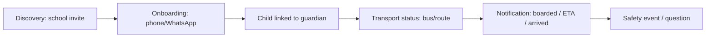
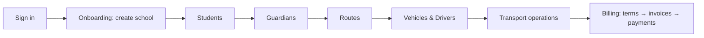
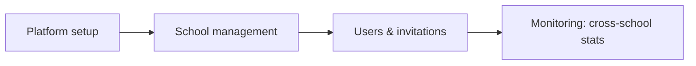

# User Flows (core)

> Only the flows we currently believe matter. Flows are hypotheses until validated.
> **DRAFT — NOT APPROVED.**

## Parent (proposed)

Evidence: marketing copy + `guardians.whatsapp`, `students.guardian_id`, `scan_events`.
Today: **not implemented** (no parent UI, no WhatsApp integration).

## School admin (current, needs fixes)

Evidence: `/admin` and sub-pages. Known breaks: **first-school dead-end**, invisible
feedback, QR regenerate.

## Driver (proposed)

Evidence: `driver` role + `scan_events` table. Today: **not implemented**.

## Platform admin (current)

Evidence: `/tafi`, `/tafi/users`. Working (needs QA + the first-school fix upstream).

## Open flow questions

- Is the parent flow WhatsApp-only (no app), or is a light web view acceptable?
- Where does billing sit relative to daily operations in the MVP?
- Is driver check-in manual (list) or scan-based for v1?
